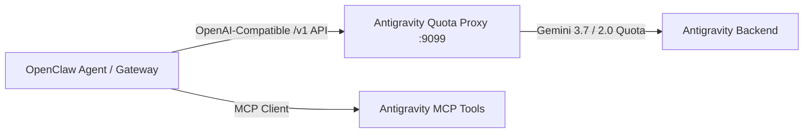

# ⚡ OpenClaw + Google Antigravity (Gemini 3.7 / 2.0 Quota Bridge)

This workspace bridges **OpenClaw** to your **Google Antigravity environment**, allowing OpenClaw to run autonomous workflows, web scraping, and tool orchestration using your **Gemini 3.7 / 2.0 Thinking quotas**.

---

## 🏛️ Architecture



---

## 🚀 Active Setup & Endpoints

- **Proxy URL**: `http://127.0.0.1:9099/v1`
- **Models Available**:
  - `gemini-3.7-flash` *(Default - High Reasoning & Fast Token Generation)*
  - `gemini-3.7-pro` *(Complex Coding & Architectural Analysis)*
  - `gemini-2.0-flash-thinking-exp-01-21` *(Deep Reasoning with Thinking Tokens)*
  - `gemini-2.0-flash` *(High-Throughput Scraping & Automation)*

---

## ⚙️ Running OpenClaw with this Setup

### 1. Run OpenClaw with the configuration:
```bash
openclaw run "Your task here" --config /Users/apple/Desktop/anto/openclaw-antigravity-bridge/openclaw.json
```

### 2. Point any OpenAI-compatible tool to this proxy:
```bash
export OPENAI_BASE_URL="http://127.0.0.1:9099/v1"
export OPENAI_API_KEY="sk-antigravity-local-quota"
```

### 3. Verification Test:
```bash
curl -X POST http://127.0.0.1:9099/v1/chat/completions \
  -H "Content-Type: application/json" \
  -d '{"model": "gemini-3.7-flash", "messages": [{"role": "user", "content": "Explain quantum computing briefly"}]}'
```
