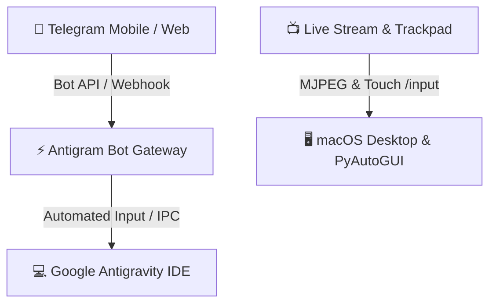

# ⚡ Antigram

> **Direct Telegram Gateway & Remote Live Touchpad for Google Antigravity IDE**

Antigram connects **Telegram** directly to **Google Antigravity IDE**, allowing full remote control, task prompting, live screen streaming, and interactive remote touch / mouse trackpad control from anywhere in the world.

---

## 🌟 Key Features

1. **📱 Two-Way Telegram Control**: Send prompts, trigger workflows, get real-time transcript updates, and accept actions directly inside Telegram.
2. **📺 Live Low-Latency Screen Mirror**: Ultra-smooth desktop stream accessible securely via phone browser or Mini App.
3. **🖱️ Mac Trackpad Remote**: 
   - 1-finger swipe to move cursor smoothly
   - 1-finger tap to Left-Click
   - 2-finger tap to Right-Click
   - 2-finger swipe to Scroll Up / Down
4. **☕ Keep Awake (Caffeinate)**: Built-in background service preventing Mac standby/sleep while you're away.
5. **🍏 Native macOS App & DMG Installer**: Complete standalone desktop application and menu bar companion.

---

## 🚀 Quick Start

### 1. Launch the Telegram Gateway
```bash
python3 telegram_bot.py
```

### 2. Launch the Live Screen Mirror Server
```bash
python3 screen_mirror.py
```

### 3. Build & Install DMG
```bash
bash build_dmg.sh
```

---

## 🛠️ Architecture


